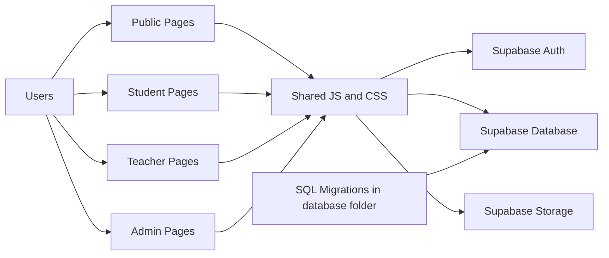

# Architecture Diagram

## Navigation

- Docs Home: [README.md](README.md)
- Project README: [../README.md](../README.md)

This document maps how pages, shared modules, and Supabase services interact.

## High-Level Architecture

## Runtime Layers

1. Presentation layer
- Public pages in public folder
- Student pages in student folder
- Teacher pages in teacher folder
- Admin pages in admin folder

2. Shared application layer
- shared/js/config.js: environment and app constants
- shared/js/supabase.js: Supabase client init
- shared/js/auth.js: login/session behavior
- shared/js/modules.js: module and lesson interactions
- shared/js/uploads.js: upload behavior
- shared/js/utils.js: helper methods

3. Data and identity layer
- Supabase Auth for user identity and sessions
- Supabase Postgres for app data
- Supabase Storage for files and media
- RLS policies enforcing role-based access

## Request Flow Example

1. A user opens a role page.
2. The page loads shared modules from shared/js.
3. shared/js/supabase.js initializes the client with credentials from shared/js/config.js.
4. A query or upload request is sent to Supabase.
5. RLS policies allow or deny the operation.
6. UI renders state or error feedback.

## Data Ownership Boundaries

- Public pages should not use privileged operations.
- Student views should be scoped to student-owned records.
- Teacher views can manage instructional content and submission workflows.
- Admin views should be the only path for system-level controls.

## Future Architecture Additions

- Add sequence diagrams for authentication lifecycle and submission review workflow.
- Add dependency graph for shared JS modules.
- Add per-role page-to-module map with ownership tags.

---

**Previous:** [quickstart-contributors.md](quickstart-contributors.md) | **Next:** [data-model-reference.md](data-model-reference.md)
